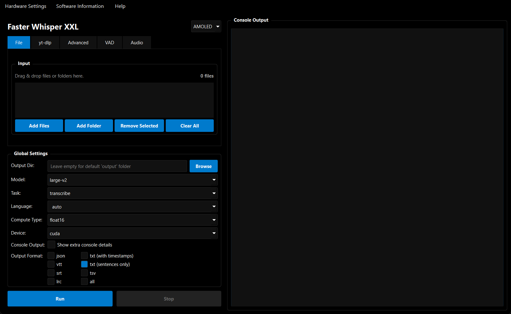

# Faster Whisper XXL GUI



Faster Whisper XXL GUI is a desktop interface for the Faster Whisper XXL transcription engine. It supports local files, YouTube downloads, and a wide range of output formats with configurable VAD/audio settings.

## Features

- File and YouTube transcription (audio-only or full video).
- Automatic dependency setup (Faster Whisper XXL + FFmpeg).
- Model/task/language controls plus VAD and audio options.
- Multiple output formats (SRT, VTT, JSON, TXT, etc.).
- Light/Dark/AMOLED themes.
- Persistent settings.

## Quick Start (Windows)

1. Download the latest `.exe` from the [Releases](https://github.com/cbro33/Faster-Whisper-XXL-GUI/releases) page.
2. Run it (no installation required).
3. On first launch, accept the prompt to download and set up Faster Whisper XXL + FFmpeg.

## Run From Source

1. Install Python 3.8+ and `pip`.
2. Clone and install:
   ```bash
   git clone https://github.com/cbro33/Faster-Whisper-XXL-GUI.git
   cd Faster-Whisper-XXL-GUI
   pip install -r requirements.txt
   ```
3. Launch:
   ```bash
   python src/faster-whisper-xxl-gui.py
   ```

## Manual Setup (If Auto Download Fails)

Auto Setup is still a WIP and may not work all time on every machine. If ther are issues, you can do a manual installation.
Download the standalone Faster Whisper XXL archive and extract its contents into the app `bin` folder.

- [Release page](https://github.com/Purfview/whisper-standalone-win/releases/tag/Faster-Whisper-XXL)
- [Windows archive](https://github.com/Purfview/whisper-standalone-win/releases/download/Faster-Whisper-XXL/Faster-Whisper-XXL_r245.4_windows.7z)
- [Linux archive](https://github.com/Purfview/whisper-standalone-win/releases/download/Faster-Whisper-XXL/Faster-Whisper-XXL_r245.4_linux.7z)

If extraction fails on Windows, install [7-Zip](https://www.7-zip.org/).

## Usage

1. Add files in the **File** tab or provide a URL in **yt-dlp**.
2. Adjust settings in **Global Settings**, **Advanced**, **VAD**, or **Audio** tabs.
3. Click **Run** and check the console output for progress.
4. Outputs are saved to your chosen output directory (defaults to `output` in the app folder).

## Docs

Detailed options and hardware guidance live in the [Wiki](https://github.com/cbro33/Faster-Whisper-XXL-GUI/wiki).

## Contributing

Issues and pull requests are welcome.

## License

This project uses the [GNU GPL 3](https://www.gnu.org/licenses/gpl-3.0.html). See [LICENSE](LICENSE).
